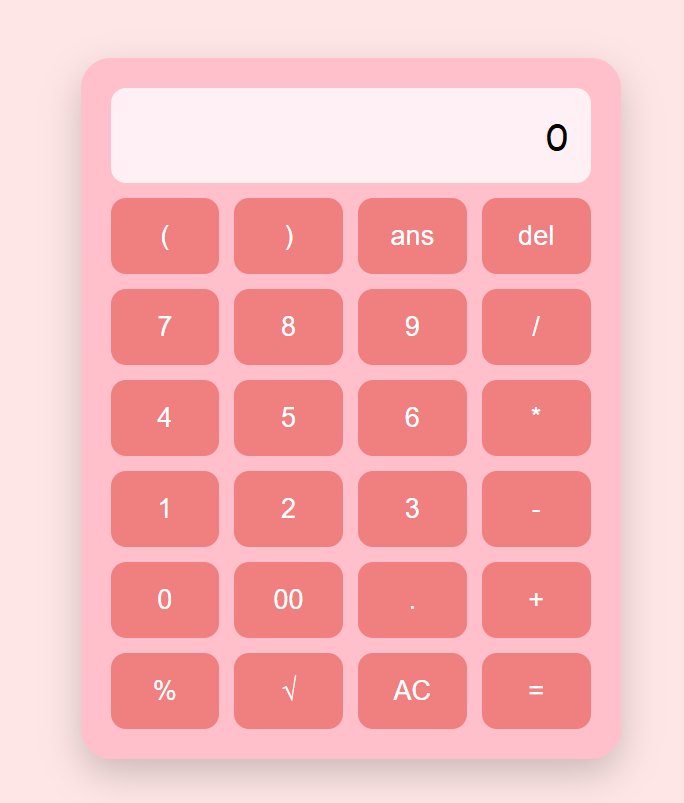
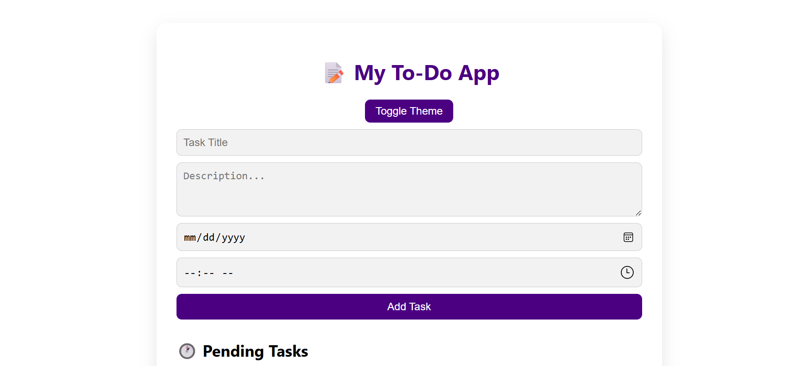
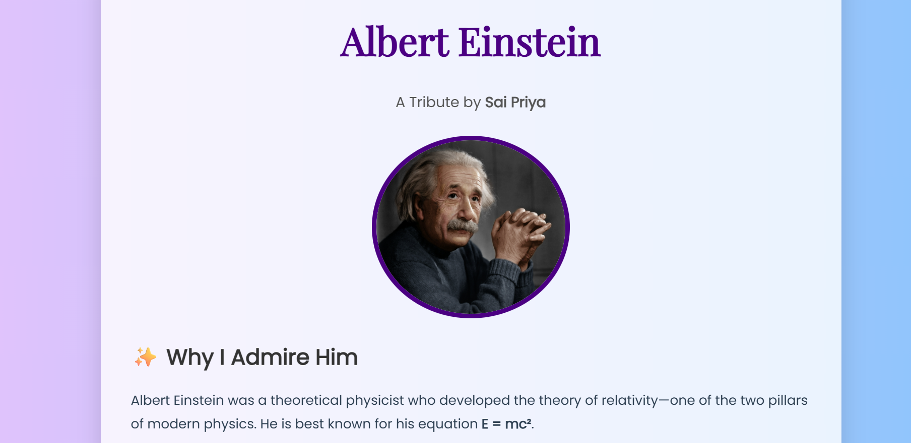
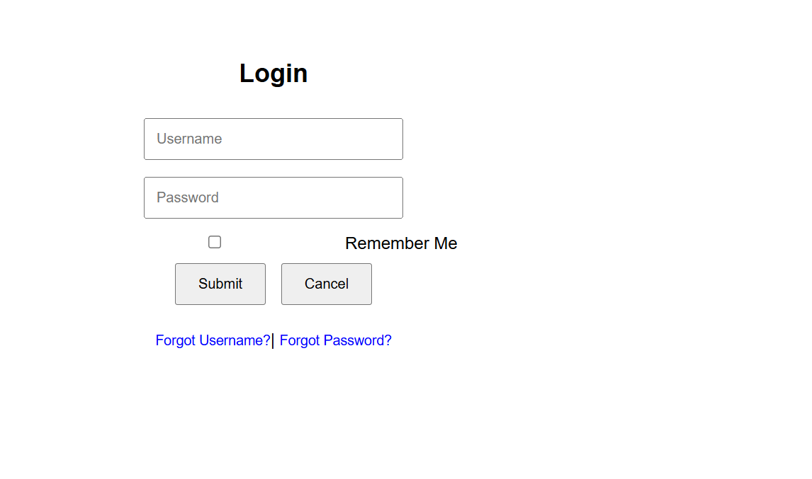

# 🌟 Web Development Projects by Sai Priya

This repository includes four beginner-friendly and fully functional web applications created using HTML, CSS, and JavaScript. Each project showcases a unique use case and helps build frontend development skills.

---

## 🧮 1.Calculator

### 📋 Description:
A feature-rich calculator built using HTML, CSS, and JavaScript. It includes advanced buttons and logic.

### 🔧 Features:
- Supports: Add, Subtract, Multiply, Divide, Modulus, Square Root
- Special buttons: `(` `)` `ans` `del` `clear` `AC` `ENTER` `→` `00`
- `ans` stores the previous answer
- Clean layout using grid system

### 🛠️ Technologies:
- HTML
- CSS (Grid Layout)
- JavaScript (DOM Manipulation, eval logic)

---

## ✅ 2. To-Do Web App

### 📋 Description:
An interactive and advanced to-do list manager. Users can add tasks with details, set deadlines, mark them complete, and get notifications — all saved using local storage.

### 🔧 Features:
- Add title, description, date, and time
- View as Pending or Completed
- Edit/Delete any task
- Light & Dark theme toggle
- Notification alerts before deadline
- Local storage support (data saved even after refresh)

### 🛠️ Technologies:
- HTML
- CSS (Responsive design)
- JavaScript (LocalStorage, Notification API)

---

## 🙏 3. Tribute Page - Albert Einstein

### 📋 Description:
A simple and beautiful tribute page for Albert Einstein with his image, bio, and motivational quote. Created to practice semantic HTML and basic CSS styling.

### 🔧 Features:
- Appealing header and fonts
- Inspirational quotes and facts
- Responsive layout
- Footer with author credit

### 🛠️ Technologies:
- HTML
- CSS (Google Fonts, Flexbox)

---

## 🔐 4. Login Authentication System

### 📋 Description:
A basic login form with strong password validation and user-friendly options. Useful for understanding JavaScript-based form handling and UI behavior.

### 🔧 Features:
- Password masking
- Validation (Starts with uppercase, includes number & symbol)
- "Remember Me" option
- Forgot username/password links
- Submit & Cancel buttons

### 🛠️ Technologies:
- HTML
- CSS
- JavaScript (form validation logic)

---

## 🖼️ Project Screenshots

### 🧮 Calculator

---

### ✅ To-Do App

---

### 🙏 Tribute Page

---

### 🔐 Login System

---

## 📂 How to Run These Projects

1. Download or clone the repository.
2. Open each project folder.
3. Double-click on `index.html` to run it in your browser.

---

## 🧑‍💻 Author

> Built with ❤️ by **Sai Priya**

---

## 📬 Connect with Me

- 💼 [LinkedIn](https://www.linkedin.com/in/guttula-sai-priya-798016348/) 
- 📧 Email: (sattibabu.gutttula88@gmail.com)

---

